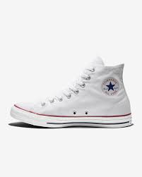
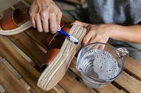

# How to clean shoes

Maintaining a polished and professional image requires knowledge of how to clean one's shoes.

# Warning! Not correctly following the steps could lead to destruction of shoes.
### Required Materials

- Shoes
- Toothbrush
- Dish soap
- Newspaper
- Water
- Towel
- Large bowl or cup

### Steps
1. Remove the laces from your shoes
2. Mix one cup of water with dish soap
3. Dip the towel into the mixture 
4. Scrub the bottom lip of the shoes

 - Scrub firmly and thoroughly to ensure best results

5. Dip the toothbrush into the soap mixture
6. Utilize the bristles on the brush to lightly clean the fabric of the shoes
7. Apply additional spot treatment with dish soap where needed
8. Insert bunches of newspaper into the inside of shoes
9. Let shoes dry
10. Relace your shoes
